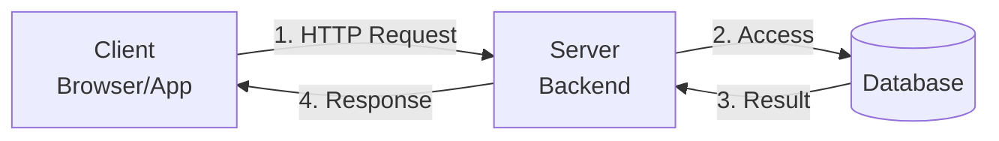
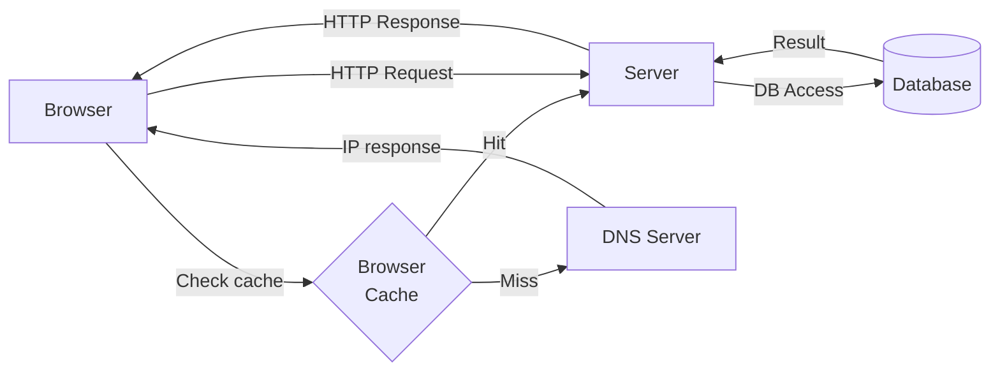

# Building Single Server Setup

## Single server setup



- **1. HTTP Request**: Frontend (browser/app) -> server
- **2. Access**: Server -> database
- **3. Result**: Database -> server
- **4. Response**: Server -> client
- **5. Rendering**: Displayed on the client side

## Sample Response

```http
GET /users/12
```

```json
{
  "id": 12,
  "name": "John Doe",
  "email": "john@example.com",
  "created_at": "2026-04-24"
}
```

## Single server setup with DNS resolve and DB



## Step-by-step flow (simplified)

- **1** Browser checks DNS cache
- **2** If cache hit, send request to server
- **3** If cache miss, query DNS server
- **4** Receive IP address from DNS server
- **5** Send HTTP request to server
- **6** Server accesses database
- **7** Database returns result
- **8** Server returns HTTP response
