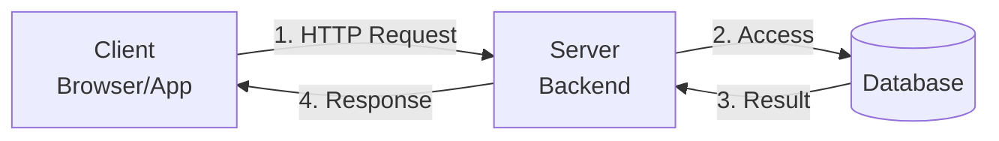
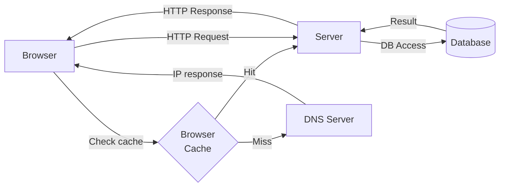
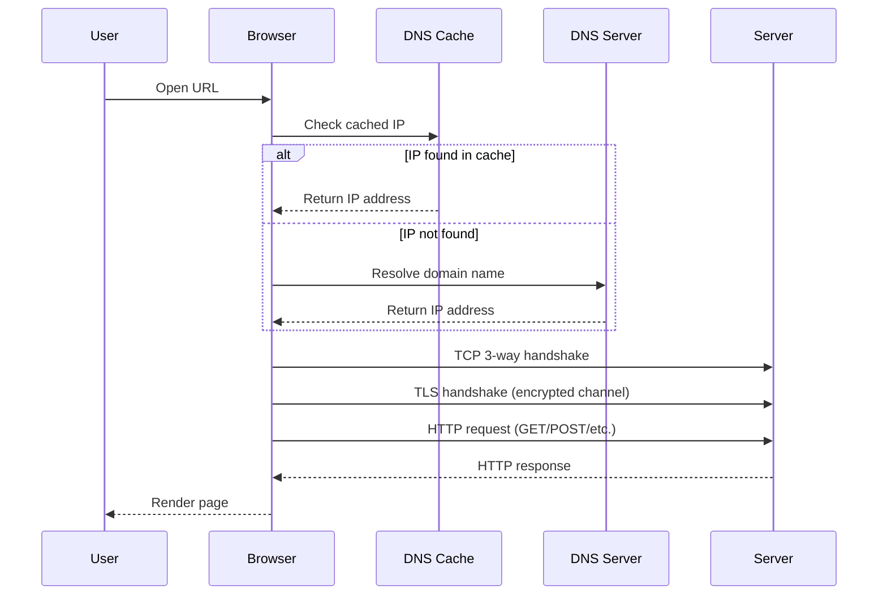
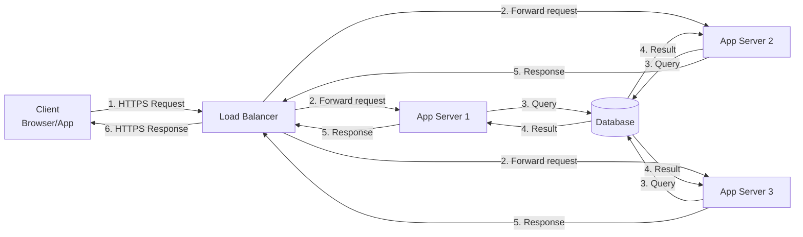
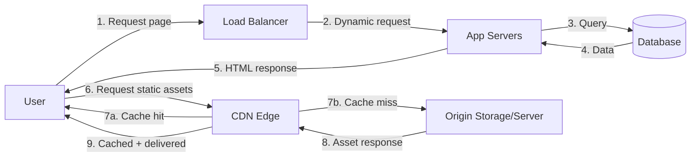

# Building Single Server Setup

## Single server setup



- **1. HTTP Request**: Frontend (browser/app) -> server
- **2. Access**: Server -> database
- **3. Result**: Database -> server
- **4. Response**: Server -> client
- **5. Rendering**: Displayed on the client side

## Sample Response

```http
GET /users/12
```

```json
{
  "id": 12,
  "name": "John Doe",
  "email": "john@example.com",
  "created_at": "2026-04-24"
}
```

## Single server setup with DNS resolve and DB



## Step-by-step flow (simplified)

- **1** Browser checks DNS cache
- **2** If cache hit, send request to server
- **3** If cache miss, query DNS server
- **4** Receive IP address from DNS server
- **5** Send HTTP request to server
- **6** Server accesses database
- **7** Database returns result
- **8** Server returns HTTP response

## What happens when opening a URL in a browser



### Flow

- **DNS**: Browser first checks DNS cache. If found, it uses the cached IP; otherwise it resolves via DNS server.
- **TCP**: Browser starts a TCP 3-way handshake to establish a reliable connection.
- **TLS**: Browser negotiates encryption; after this, data is encrypted in transit.
- **HTTP**: Browser sends an HTTP request to the server using methods like `GET` or `POST`.
- **Browser Rendering**: Browser parses and renders the response data for the user.

## Single server setup with a Load Balancer



### Request flow with Load Balancer

- **1** Client sends request to the Load Balancer.
- **2** Load Balancer routes to one healthy app server (for example by round robin or least connections).
- **3** Selected app server accesses the database.
- **4** Database returns data to that app server.
- **5** App server sends the response back to the Load Balancer.
- **6** Load Balancer returns the response to the client.

### Why add a Load Balancer

- **Higher availability**: Traffic can continue even if one app server fails.
- **Horizontal scaling**: Add more app servers to handle more traffic.
- **Health checks**: Unhealthy servers are automatically removed from routing.

### Design notes

- Keep app servers **stateless** so any server can handle any request.
- Store shared state in external systems (for example, database or cache).
- If you use sessions, prefer shared session storage or token-based auth.

## Load Balancer setup with CDN for static content

Use a CDN to deliver static assets such as images, videos, CSS, and JavaScript from edge locations close to users.



### Why CDN helps

- **Lower latency**: Users download static files from the nearest edge location.
- **Better throughput**: Large files (especially videos/images) are offloaded from app servers.
- **Global performance**: Users in each region get content from nearby POPs (Points of Presence).

### Geographic example

- Origin/content server is in **San Francisco**.
- A user in **Los Angeles** is routed to a nearby CDN edge and gets faster responses.
- A user in **Europe** is routed to a European edge; this is still faster than fetching every file directly from San Francisco.

### CDN provider examples

- **Cloudflare**: Popular for free plans, robust DDoS protection, and extensive global coverage.
- **Akamai**: A leader in enterprise-grade security and massive edge server networks.
- **Amazon CloudFront**: Highly scalable and integrated seamlessly with Amazon Web Services (AWS).